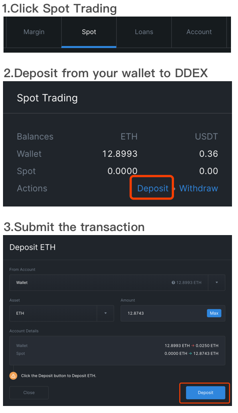
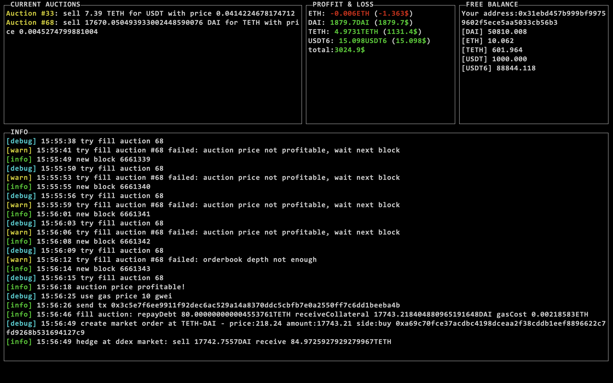

# DDEX Liquidation Bot

Participate in the liquidation on DDEX to earn money 💰💰💰

## Getting Started

Margin positions will be liquidated if the collateral rate too low. 
When a liquidation occurs, the borrowers' assets are sold off in a form of a dutch auction to repay the loan. 
This bot help you bid the auction when profitable.

The bot uses an arbitrage strategy: Sell collateral on DDEX immediately after receive it from an auction. For example:

 - An auction sell *10ETH* at price *160USDT*
 - The bot buy *10ETH*
 - The bot sell *10ETH* on ddex at price *170USDT*
 - Earn *10\*170-10\*160=100USDT*

### Prerequisites

You need to prepare some asset(e.g. ETH, USDT, DAI) in your DDEX spot trading balance. 



In order to run this container you'll need docker installed.

* [Windows](https://docs.docker.com/windows/started)
* [OS X](https://docs.docker.com/mac/started/)
* [Linux](https://docs.docker.com/linux/started/)

### Run Container

```shell
docker run -it --rm -v /your/file/path:/workingDir --name=auctionBidder hydroprotocolio/liquidation_bot:latest /bin/main
```

If you want to test on ropsten

```shell
docker run -it --rm -v /your/file/path:/workingDir --name=auctionBidder --env NETWORK=ropsten hydroprotocolio/liquidation_bot:latest /bin/main
```

### Screen Snapshot

The bot try to fill every current auction when new block listened. It also records your profit and loss and show free trading balance of the address you use. 



#### Volumes

* `/your/file/path` - Where liquidation history, config and logs stored

##### Useful File Locations

* `/your/file/path/auctionBidderSqlite` - Your bid history is recorded in sqlite file
  
* `/your/file/path/config.json` - Bot parameters

* `/your/file/path/log.%Y%m%D` - Logs

#### Parameters

The bot will ask for the following parameters for the first run:

* `PRIVATE_KEY` - Private key of the account to join liquidation

* `ETHEREUM_NODE_URL` - Ethereum node url. Get a free node at [infura](https://infura.io).

* `MARKETS` - Which markets' auction I am interested in. Separated by commas. `e.g. ETH-USDT,ETH-DAI` 
	
* `MIN_AMOUNT_VALUE_USD` - I don't want to participate the auction unless its USD value greater than *X* `e.g. 100`

* `PROFIT_MARGIN` - I don't want to bid unless the profit margin greater than *X* `e.g. 0.01` (0.01 means 1%)
	
* `GAS_PRICE_LEVEL` - `fast`, `super-fast` or `flash-boy` will use *FAST* gas price from [ethgasstation](https://ethgasstation.info/) plus `0Gwei`, `10Gwei` and `25Gwei` perspectively

* `MAX_SLIPPAGE` - Don't arbitrage if the slippage greater than *X* `e.g. 0.05` (0.05 means 5%) 

Edit `/your/file/path/config.json` and restart bot to adjust parameters.

## Contributing

1. Fork it (<https://github.com/hydroprotocol/liquidation_bot/fork>)
2. Create your feature branch (`git checkout -b feature/fooBar`)
3. Commit your changes (`git commit -am 'Add some fooBar'`)
4. Push to the branch (`git push origin feature/fooBar`)
5. Create a new Pull Request

## License

This project is licensed under the Apache-2.0 License - see the [LICENSE.txt](LICENSE.txt) file for details
